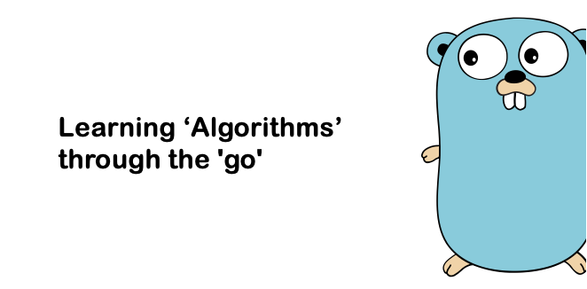

## 알고리즘

Go를 통해 알고리즘을 구현해보고 학습하기 위한 레파지토리 입니다 

[BaaarkingDog](https://www.youtube.com/@BaaaaaaaaaaaaaaaaaaaaarkingDog)(유튜브) 알고리즘 강의 영상과 ‘[서적-이것이 취업을 위한 코딩테스트다](https://www.yes24.com/Product/Goods/91433923)’를 학습하여 알고리즘 구현 및 정리를 하였습니다

배열(Array) [[링크]](./array/README.md) 
 
연결 리스트(Linked Lisk) [[링크]](./linkedlist/README.md) 