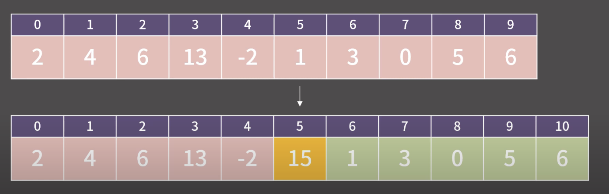
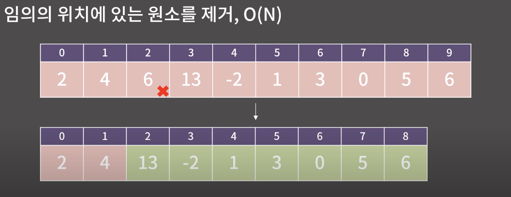

# 배열 (Array)

## **바킹독 - 알고리즘 - 배열**

### 배열이란?

메모리 상에 원소를 *연속* 하게 배치한 자료구조

- > 자료구조의 배열은 길이가 자유롭다라고 설정

### 성질?

- O(1) K번째 원소를 확인/ 값 변경 가능
- 추가적으로 소모되는 메모리의 양이 거의 없다 (No overhead)
- Cache hit rate가 높음 (지역 참조성의 원리에 의해)
- 메모리 상에 연속한 구간을 잡아야해서 할당에 제약이 걸림 -> 단점….

### 배열에서의 데이터 활용 예제 시의 시간 복잡도

- 특정 순서의 데이터를 조회(수정) -> O(1)
- 원소를 끝에 추가 -> O(1)
- 마지막 원소 제거 -> O(1)
- **임의의 위치에 원소를 추가 -> O(n)**
    
    특정 주소를 기준으로 뒤의 시간을 밀어야하기 때문에
    
    
    
- **임의의 위치에 원소를 제거 -> O(n)**
    
    특정 주소를 기준으로 뒤의 시간을 당겨야하기 때문에
    
    
    

### TIP

- 삽입하고자하는 데이터의 인덱스를 처음부터 체크하기보다는 배열의 뒤에서부터 시작해서 데이터를 당기도록 하자(삭제하고자 할때는 입력받은 인덱스 기준부터 옮기면 효율적임)

### 구현

- 최초 구현 [[link]](./array.go)
- TIP을 활용한 개선 구현 [[link]](./improvementArray.go)

### GO 구현시 slicing 기법을 통해 구현하는 법

- 삭제
    
    ```go
    slice = append(slice[:idx], slice[idx+1:]...)
    ```