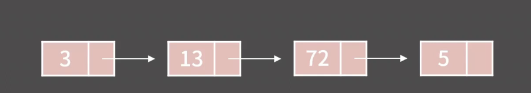

# 연결 리스트 (Linked List)

## 정의

원소를 포함할 때 다음 원소의 주소를 가지고 있어 연결되어 있는 구조로 되어 있음 (순차적으로 메모리에 할당 되어진 구조가 아니다)

### 성질

- k 번째 원소를 확인/변경하기 위해 O(k)가 필요
    
    
    
- 임의의 위치에 원소를 추가/임의 위치의 원소 제거는 O(1)
    
    → 값의 위치를 알고 있는 경우에만 가능 (특정 인덱스 값만 전달해주고 찾기위해서는 결국 n만큼 반복이 필요)
    
- 원소들이 메모리 상에 연속해 있지 않아 Cache hit rate가 낮지만 할당이 다소 쉬움

### 종류

<aside>
💡 **연결 리스트는 추가적으로 필요로 한다**
원소를 추가 시 이전 원소의 주소와 다음 주소의 값을 가지기 위해 컴퓨터 cpu에서 제공하는 크기만큼 데이터를 추가적을 필요로 한다

</aside>

- 단일 연결 리스트:  각 원소가 **다음 원소에 대한 주소 값만** 가지고 있음
- 이중 연결 리스트:  각 원소가 **이전 원소의 주소, 다음 원소의 주소** 모두 가지고 있음
- 원형 연결 리스트:  끝과 처음이 연결되어 고리형태의 자료구조

### 사례

테스트 에디터에 많이 사용된다…

### GO 언어에서 지원하는 linked lisk 패키지 - container/list

```go
package main

import (
    "container/list"
    "fmt"
    "strconv"
)

func main() {
    // New list.
    values := list.New()
    // Add 3 elements to the list.
    values.PushBack("bird")
    values.PushBack("cat")
    values.PushFront("snake")
    // Add 100 elements at the front.
    for i := 0; i < 20; i++ {
        // Convert ints to strings.
        values.PushFront(strconv.Itoa(i))
    }
    
    // Loop over container list.
    for temp := values.Front(); temp != nil; temp = temp.Next() {
        fmt.Println(temp.Value)
    }
}
```