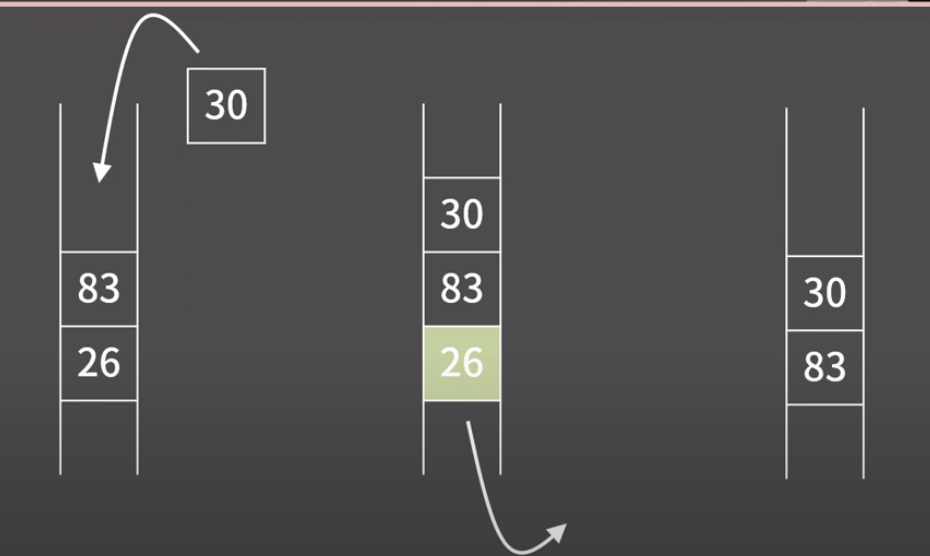

# Queue

- 정의
    
    먼저 들어간 요소가 먼저 나오는 형태 ex) 공항 줄 또는 음식점 줄
    
    FIFO (First In First Out)
    
    
    

- 정의
    
    1) 원소의 추가가 O(1)
    
    2) 원소의 제거가 O(1)
    
    3) 제일 앞/뒤의 원소 확인이 O(1)
    
    4) 제일 앞/뒤가 아닌 나머지 원소들의 확인/변경이 원칙적으로는 불가능