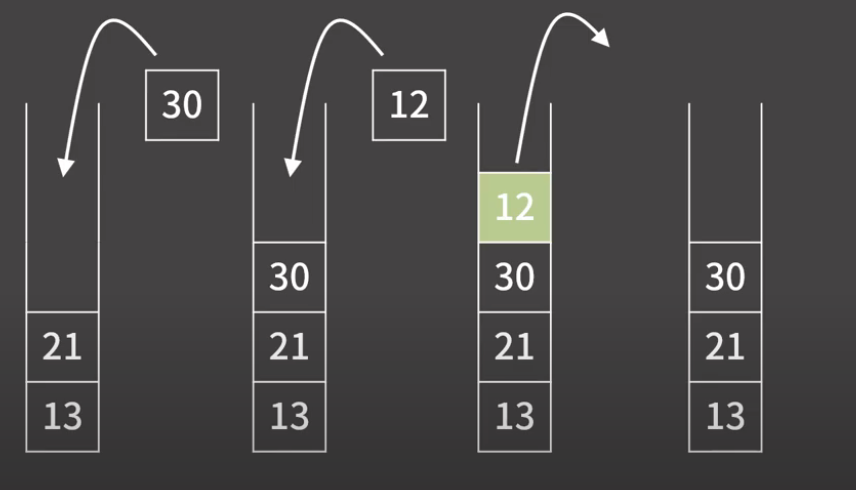

# Stack

- 정의
    
    자료 구조 끝에서만 데이터를 뽑을 수 있는 구조 
    
    FILO(First In Last Out) 자료 구조 
    
    
    

- 성질
    
    1) 원소의 추가가 O(1)
    
    2) 원소의 제거가 O(1)
    
    3) 제일 상단의 원소 확인이 O(1)
    
    4) 제일 상단이 아닌 나머지 원소들의 확인/변경이 원칙적으로는 불가능